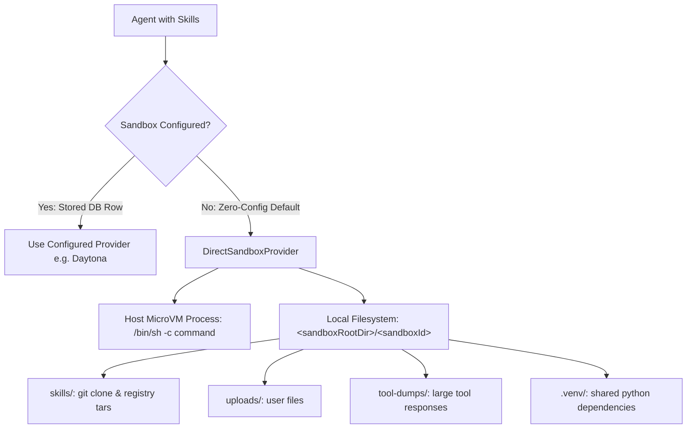

# Implementation Plan: Direct Sandbox Provider & Unconstrained Agent Skills

## Goal Description

TrueForge currently requires Daytona (`https://www.daytona.io`) as the sole production sandbox provider for agent skill execution. This creates hard gates across `/capabilities`, agent creation/validation, and turn streaming that block using agent skills unless Daytona API keys and cloud snapshots are configured.

In a deployment where TrueForge runs inside an isolated microVM, the microVM itself is the security boundary. This plan introduces a native, unconstrained `DirectSandboxProvider` that executes commands and skills directly in the microVM host OS using Node.js child processes, makes it the zero-config default, and removes all opinionated Daytona restrictions for agent skills.

## User Review Required

> [!IMPORTANT]
> `DirectSandboxProvider` executes shell commands (`/bin/sh` / `python3`) directly within the environment where TrueForge runs. This is intended for environments where the TrueForge process itself is isolated inside a microVM or dedicated container.

> [!NOTE]
> Daytona support is preserved as a configurable option in the catalog and Settings API. Existing setups that configure Daytona via `PUT /settings/sandbox-providers` will continue to use Daytona as before.

## Open Questions

None. The design (Approach 1: Dedicated DirectSandboxProvider as zero-config default) has been approved.

## Proposed Changes



---

### packages/trueforge-core (Core Execution Layer)

#### [NEW] `DirectSandboxProvider.ts`

- **Location**: `packages/trueforge-core/src/core/sandbox/provider/DirectSandboxProvider.ts`
- Implements `SandboxProvider` contract.
- Runs commands via `node:child_process.spawn` with process-group kill on timeout.
- Implements `uploadFile` and `downloadFile` via `node:fs/promises`.
- `buildImage()` and `getImageBuildStatus()` return `{ status: 'ready', reason: null, metadata: null }`.
- Scopes paths under `<sandboxRootDir>/<sandboxId>/`: `skills/`, `uploads/`, `tool-dumps/`.

#### [MODIFY] `packages/trueforge-core/src/core/index.ts`

- Export `DirectSandboxProvider` and `DirectSandboxProviderOptions`.

#### [MODIFY] `packages/trueforge-core/src/agent-session/TurnResourceResolver.ts`

- Update `specWantsSandbox` so that agents specifying `spec.skills` automatically activate sandbox execution even if `spec.config.sandbox.enabled` is false.

```typescript
function specWantsSandbox(spec: AgentSpec): boolean {
  return spec.config.sandbox.enabled || (spec.skills !== undefined && spec.skills.length > 0);
}
```

#### [MODIFY] `packages/trueforge-core/src/agent-session/schemas/agentSpec.ts`

- Clarify in the `sandbox.enabled` field description that skills automatically provision execution when present.

---

### packages/trueforge (Server, APIs & Configuration)

#### [MODIFY] `packages/trueforge/src/schemas/sandboxProvider.ts`

- Add `DirectSandboxProviderSchema`:

```typescript
export const DirectSandboxProviderSchema = z
  .object({
    type: z.literal('direct').describe('Direct host microVM sandbox provider.'),
    exec_timeout_ms: z
      .number()
      .int()
      .positive()
      .optional()
      .default(60000)
      .describe('Default sandbox command exec timeout in milliseconds.'),
  })
  .strict()
  .openapi('DirectSandboxProvider');
```

- Add `DirectSandboxProviderSchema` to `SandboxProviderManifestSchema` and `StoredSandboxProviderManifestSchema`.

#### [MODIFY] `packages/trueforge/catalog/sandbox-catalog.yaml`

- Add preset for `direct` provider:

```yaml
providers:
  - type: direct
    exec_timeout_ms: 60000
  - type: daytona
    exec_timeout_ms: 60000
    auto_stop_interval_in_minutes: 5
    auto_archive_interval_in_minutes: 60
    auto_delete_interval_in_minutes: 7200
```

#### [MODIFY] `packages/trueforge/src/config.ts`

- Add:
  - `DIRECT_SANDBOX_ENABLED`: boolean, default `true`.
  - `DIRECT_SANDBOX_ROOT_DIR`: string, default `path.join(appDataDir, 'sandboxes')`.

#### [MODIFY] `packages/trueforge/src/sandbox/providerUtils.ts`

- In `toSandboxProviderFromRecord`:

```typescript
case 'direct':
  return new DirectSandboxProvider({
    sandboxRootDir: configuration.DIRECT_SANDBOX_ROOT_DIR,
    defaultExecTimeoutSeconds: Math.ceil(record.manifest.exec_timeout_ms / 1000),
    fileMaxBytesForDownload: configuration.SANDBOX_FILE_MAX_BYTES_FOR_DOWNLOAD,
    logger,
  });
```

#### [MODIFY] `packages/trueforge/src/runtime/sessionResources.ts`

- In `resolveSandboxProvider`: when no provider is stored in the database and `DIRECT_SANDBOX_ENABLED` is true, automatically return `new DirectSandboxProvider(...)`.
- In `validateManifest`: do not reject agents requesting skills when `DIRECT_SANDBOX_ENABLED` is true.

#### [MODIFY] `packages/trueforge/src/apis/capabilities.ts`

- Report `sandbox: { enabled: true }` and `skill: { enabled: true }` when direct sandbox is enabled (the default).

#### [MODIFY] `packages/trueforge/src/apis/turns.ts`

- Restrict Daytona snapshot readiness checks (`checkSnapshotStatus`) to `provider.type === 'daytona'` so direct execution proceeds immediately without latency.

---

### Tests & Changesets

#### [NEW] `packages/trueforge-core/tests/core/sandbox/provider/directProvider.contract.test.ts`

- Run `runSandboxProviderContractSuite` against `DirectSandboxProvider` to verify execution statefulness, cwd scoping, file uploads, and downloads.

#### [NEW] `packages/trueforge/tests/unit/sandbox/directExecution.test.ts`

- Integration test for direct sandbox execution and skill resolution.

#### [NEW] `.changeset/direct-sandbox-provider.md`

- Changeset for published packages `@truefoundry/trueforge-core` and `@truefoundry/trueforge`.

---

## Verification Plan

### Automated Tests

1. **Core Provider Contract Suite**:
   ```bash
   pnpm --filter @truefoundry/trueforge-core test tests/core/sandbox/provider/directProvider.contract.test.ts
   ```
2. **TrueForge Schemas & Provider Utils Tests**:
   ```bash
   pnpm --filter @truefoundry/trueforge test tests/unit/schemas/sandboxProvider.test.ts
   ```
3. **Capabilities & Runtime Resolution Tests**:
   ```bash
   pnpm --filter @truefoundry/trueforge test tests/unit/apis/capabilities.test.ts tests/unit/runtime/sessionResources.test.ts
   ```
4. **Agent Session Turn Resolver Tests**:
   ```bash
   pnpm --filter @truefoundry/trueforge-core test tests/agent-session/
   ```
5. **Full Workspace Build & Test Run**:
   ```bash
   pnpm test
   ```

### Manual Verification

1. Start TrueForge in standalone or distributed mode with no Daytona credentials configured.
2. Call `GET /api/v1/capabilities` and verify `skill.enabled === true` and `sandbox.enabled === true`.
3. Create an agent configured with a git skill (e.g. from GitHub/GitLab).
4. Run a turn with the agent and verify:
   - Skills are cloned into `<sandboxRootDir>/<sandboxId>/skills`.
   - `<skills>` section is present in system prompt instructions.
   - Agent can execute commands via `exec` tool in the microVM.
